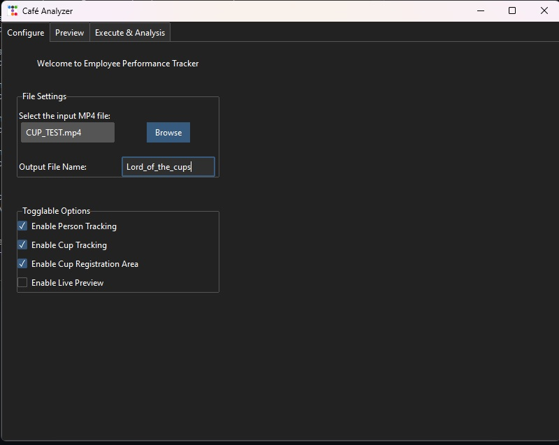
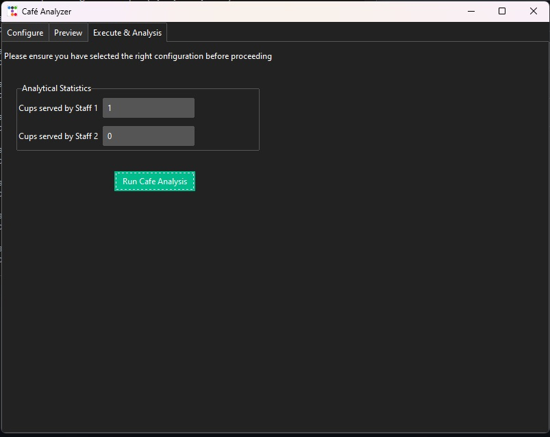
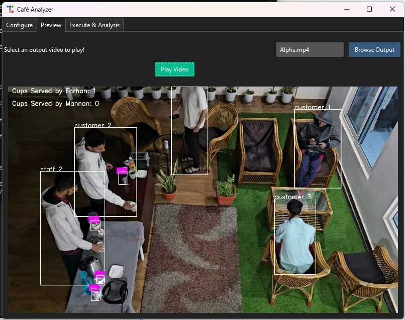

# Employee-Tracker
This is an ongoing Project on Employee Performance Tracker for a Coffee Shop, that is to be presented in an upcoming Hackathon.  
Project Start Date: 07/06/2024

# Goal
To track the Employee Performance in a Coffee Shop by tracking their actions using a live camera tracking system.

# Features
- A fully operational Front-End GUI that is well integrated with the backend and allows for greater control over the model. 
- Uniquely identifies each person in the shop, staff will be distinct from the customers (Staff Facial Recognition yet to be implemented)
- Identifies and tracks the position of objects such as cups
- Counts the number of cups served by each staff member
- Tracks the Customer's waiting time (currently being worked on)
- Tracking additional statistics such as: Number of customers that enter the shop, Busy Hours, etc... (being worked on - at a low priority)
- Detecting Employee actions (to track employee idle time - yet to be implemented)

# Made with
- Python 3.10
- Ultralytics 8.2.16 (using Yolov8x pre-trained model)
- PyTorch 2.3.0 (with CUDA Acceleration)
- OpenCV (4.9.0 - Custom Wheel with CUDA acceleration)
- ttkbootstrap 1.10.1

# Watch the Demo
Note: The demo video was made before the recent GUI version commit.  
[![YouTube Video Thumbnail] 
  
**Front-End Preview**    
### Screenshot 1

Screenshot 1: Configuration Page (Landing Page)  

### Screenshot 2

  
  

Description of Screenshot 2 goes here.            Description of Screenshot 3 goes here.

### Screenshot 3

# Want to run it on your system?
**Step 1:** CLONE THE REPOSITORY    

**Step 2:** Importing Environment via Anaconda  
In your anaconda prompt:
> conda env create -f C:\{path-to-folder}\environment.yml   
Since the environment file was made before the GUI commit, for working with GUI file:  
> conda install ttkbootstrap  
> conda install tkvideoplayer

**Step 3:** Download the Model and video_final.mp4, place them in the same directory as the rest (input is configurable)    
These files are too large to be hosted on GitHub, as such you may download them from Google Drive:  
[yolov8x.pt](https://drive.google.com/file/d/1poPRHELrva2kPEiNSCT0M46ylor09qkp/view?usp=drive_link)  
[video_final.mp4](https://drive.google.com/file/d/1NMe1PYvQRwKvTMMGMHDIK4cUheWa_rKT/view?usp=sharing)  

**Step 4:** Once the environment is activated and all the packages have been installed  
For GUI (must have PerformanceDetection_GUI Downloaded):
> python GUI.py
For non-GUI:  
> python PerformanceDetection.py

**Step 5:** Output is produced in two ways:  
1) Live Preview as the model processes the input
2) final processed video will be available in the directory as output.mp4 (name is configurable)
